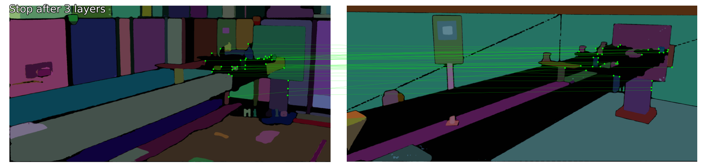
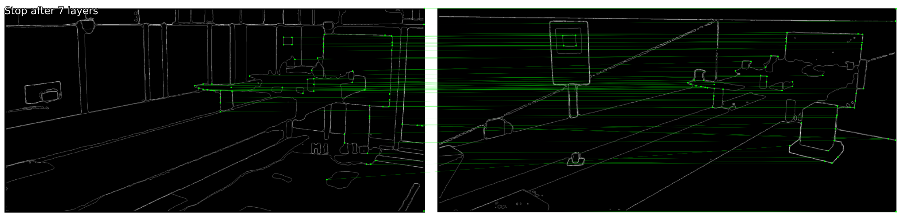

<h1 align="center">Work Experience</h1>

<!-- Your existing HTML code -->
## Robotics Deployment Engineer | Path Robotics
### Multi Arm Robot Deployment
<!-- 

  -->

  
  

- Deployed the company’s **first [AW-3](https://www.path-robotics.com/robotic-welding-systems/aw3/) multi-robot production system** at a customer site
- Developed calibration plugins and automation scripts using **Python, Bash and C++**, cutting deployment bring-up time by **30%**  
- Served as **codeowner** for robot configurations (URDF, MoveIt, clearance planner configurations)  
- Built, debugged, and deployed robotic applications in **ROS**.  
- Created documentation and trained new engineers, ensuring smooth knowledge transfer to the operations team
- Experimented with Meta’s **Segment Anything Model (SAM)** to automate URDF validation by: extracting segmentation masks from CCTV images of robotic systems, generating corresponding masks from the 3D URDF model using camera intrinsics/extrinsics, and applying **LightGlue** for feature matching and validation
- Wrote approach strategies and workflows in **Python** for Path Robotics' flagship pick, place and weld [(AF-1)](https://www.path-robotics.com/robotic-welding-systems/af1/) robotic system, achieving a welding accuracy of 95%
- **Computed spatial transforms and implemented a software testing and release pipeline for production deployment** of a custom perception hardware package, achieving higher scan cloud point densities, increased seam accessibility, and improved non-rigid registration performance.

Raw Segment Anything Model (SAM) Results + LightGlue Output:

  

Final Processed Results + LightGlue Output:

  

