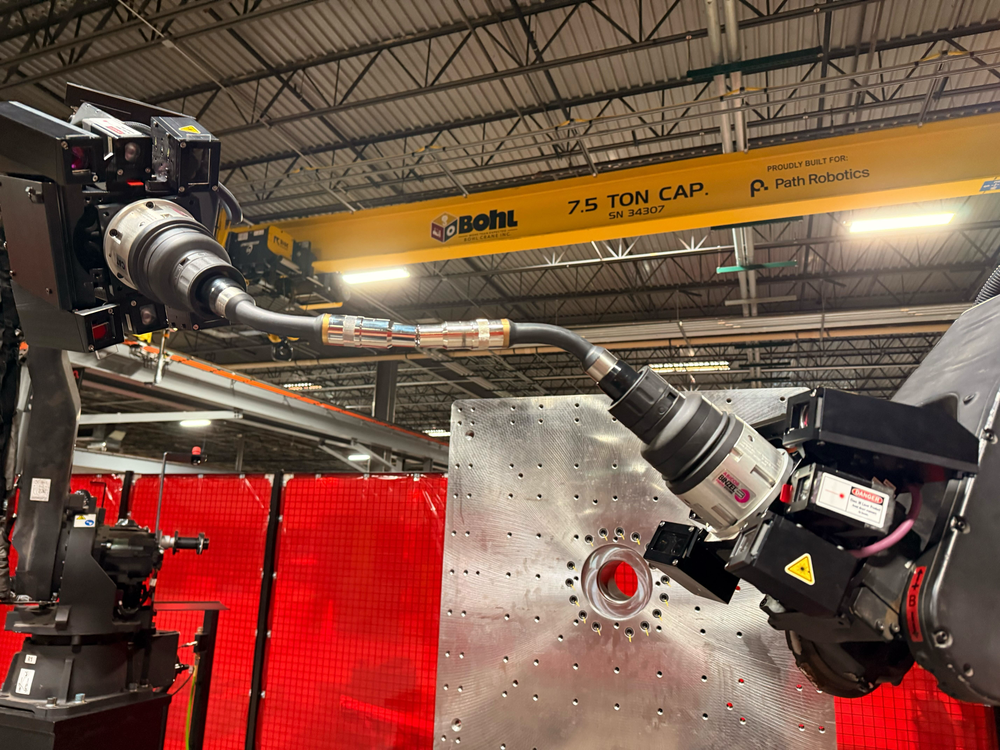
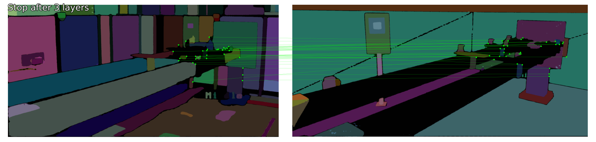
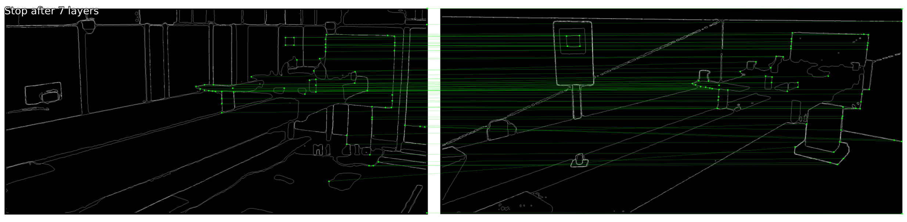

<h1 align="center">Work Experience</h1>'

## Forward Deployed Robotics Engineer | FieldAI (Feb 2026 - Present)

- Deploy **[Boston Dynamics Spot](https://bostondynamics.com/products/spot/)** robots on active customer sites, integrating FieldAI's full autonomy stack into real-world industrial environments
- Develop and deliver **client-specific features** outside the core product roadmap, bridging customer operational needs with FieldAI's platform capabilities
- Act as the **primary feedback loop** between the field and engineering teams — systematically reproducing, documenting, and triaging bugs discovered in production deployments to drive rapid resolution
- Serve as **L3 escalation support**: own and resolve complex field issues that cannot be addressed by application engineers after two rounds of debugging, and route unresolved cases to the appropriate engineering teams

## Robotics Deployment Engineer | Path Robotics (Sept 2023 - Feb 2026)
### Multi Arm Robot Deployment

  
  

- Deployed the company’s **first [AW-3](https://www.path-robotics.com/robotic-welding-systems/aw3/) multi-robot production system** at a customer site
- Developed calibration plugins and automation scripts using **Python, Bash and C++**, cutting deployment bring-up time by **30%**  
- Served as **codeowner** for robot configurations (URDF, MoveIt, clearance planner configurations)  
- Built, debugged, and deployed robotic applications in **ROS**.  
- Created documentation and trained new engineers, ensuring smooth knowledge transfer to the operations team
- Experimented with Meta’s **Segment Anything Model (SAM)** to automate URDF validation by: extracting segmentation masks from CCTV images of robotic systems, generating corresponding masks from the 3D URDF model using camera intrinsics/extrinsics, and applying **LightGlue** for feature matching and validation
- Wrote approach strategies and workflows in **Python** for Path Robotics' flagship pick, place and weld [(AF-1)](https://www.path-robotics.com/robotic-welding-systems/af1/) robotic system, achieving a welding accuracy of 95%
- **Computed spatial transforms and implemented a software testing and release pipeline for production deployment** of a custom perception hardware package, achieving higher scan cloud point densities, increased seam accessibility, and improved non-rigid registration performance.

Raw Segment Anything Model (SAM) Results + LightGlue Output:

  

Final Processed Results + LightGlue Output:

  

First multi-robot system deployment:

  <iframe src="https://drive.google.com/file/d/1z9sZqbbZgqzu9oLVIYqcdMh8ej-C6F9-/preview" width="100%" height="100%" allow="autoplay" allowfullscreen></iframe>

